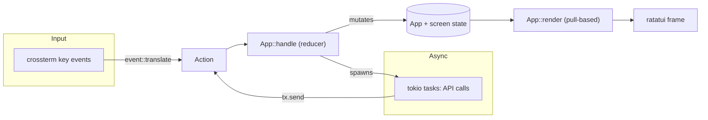

# engineer-cli architecture

`engineer-cli` is a terminal client for Engineer, built on [ratatui] + [crossterm]
for rendering, [tokio] for async, and [reqwest] for HTTP. It follows **The Elm
Architecture (TEA)**: a single owned state, a message enum, a reducer that
mutates state (and spawns async work), and a pure render pass over the current
state.

## Guides

- [UI rendering & data-layer sync](./ui-rendering.md) — how the ratatui view
  stays in step with the backend data layer (the event loop, actions, and
  pull-based rendering).
- [API layer](./api-layer.md) — how the backend HTTP client is designed and
  how it aligns with Rust-ecosystem conventions for TUI/CLI apps.
- [Authentication](./authentication.md) — how OAuth2 + PKCE and the OS keyring
  are integrated into the TUI and CLI.

## Module map

```
src/
├── main.rs            CLI entry (clap): login / logout / whoami / tui; tracing init
├── config.rs          environment presets, config.toml + env overrides, paths
├── app/               TUI shell — the TEA core
│   ├── mod.rs         App state, run_loop (tokio::select!), handle() reducer, render()
│   ├── action.rs      Action — the message enum
│   ├── event.rs       crossterm event → Action translation (keymap)
│   └── screens/       per-screen state + reducer + view (login, home, books, …)
├── ui/                presentation — layout chrome, theme, widgets, notifications
├── api/               HTTP client — ApiClient, typed models, envelope, errors
└── auth/              OAuth2 + PKCE flow, TokenProvider, keyring storage
```

## Top-level dataflow

Everything is unidirectional. Input events and async results both become
`Action`s on one channel; the reducer is the only place state changes; the next
frame renders whatever the state now says.



See [ui-rendering.md](./ui-rendering.md) for the detailed loop.

[ratatui]: https://ratatui.rs
[crossterm]: https://docs.rs/crossterm
[tokio]: https://tokio.rs
[reqwest]: https://docs.rs/reqwest
